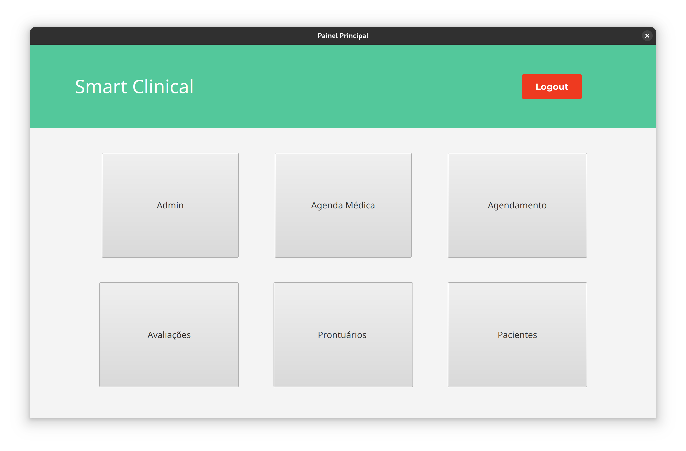

# Smart Clinical - Sua clínica mais inteligente
Smart Clinical é um sistema de gestão de usuários, consultas e avaliações para clínicas

## Desenvolvido por:
- Alysson Gabriel
- Matheus Victor
## Configuração do ambiente
### Pré-Requisitos
- Java 21
- JavaFX 21
- MySQL 8
- SGBD (Workbench, Heidi, etc.)
### Instalação
#### 1. Clonar o projeto do git.
#### 2. Criar um banco de dados com o nome desejado
#### 3. Criar na pasta da raíz do projeto um arquivo chamado "db.properties" com os seguintes comandos:
```bash
    # Configuração do banco de dados
    db.url=jdbc:URL_DO_SEU_BANCO
    db.user=SEU_USUARIO
    db.password=SUA_SENHA
```
#### 4. Importar o arquivo sql no seu banco de dados
```bash
    # Procure pelo arquivo: 
    backup_smart_clinical_final.sql
 ```
#### 5. Testar a conexão e rodar o projeto

## Funcionalidades

- Autentica e faz logout
- Recupera senha
- Controle de Roles (Admin, Médico, Recepcionista)
- Gerenciamento de usuários, consultas e pacientes
- Prontuários médicos
- Sistema de avaliações e feedbacks
- Gera relatório simples

## Screenshots
### 1. Autenticação


### 2. Recuperação de senha


### 3. Painel Principal


### 4. Gerenciamento de usuários


### 5. Controle de Roles (Limita permissões)


### 6. Sistema de Avaliações
